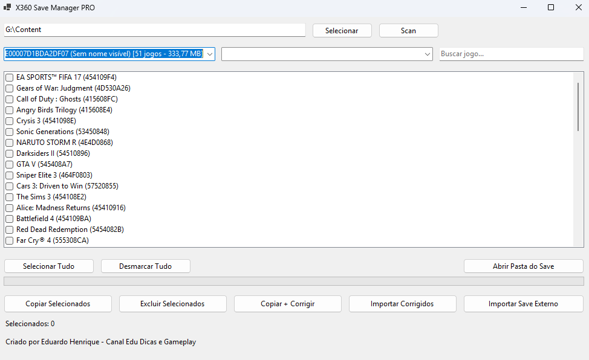

# 🎮 X360 Save Manager PRO

> 🚀 Gerencie, importe, organize e corrija saves do Xbox 360 com facilidade.

---

## 📸 Interface

<p align="center">
  
</p>

---

## ✨ Sobre o Projeto

O **X360 Save Manager PRO** é uma ferramenta desenvolvida para simplificar totalmente o gerenciamento de saves do Xbox 360.

Com uma interface simples e poderosa, o programa permite copiar saves entre perfis, importar arquivos externos (mesmo desorganizados), corrigir saves via Horizon e manter tudo organizado automaticamente.

💡 Ideal para quem:

* Faz backup de saves
* Baixa saves da internet
* Trabalha com modificação e testes
* Quer praticidade no dia a dia

---

## 🚀 Funcionalidades

### 📂 Gerenciamento Inteligente

* Detecta automaticamente perfis do Xbox 360
* Identifica jogos via banco de dados (Title ID)
* Lista saves organizados por perfil

---

### 🔄 Cópia entre Perfis

* Copie saves com poucos cliques
* Sistema de confirmação ao sobrescrever
* Mantém a estrutura correta automaticamente

---

### 📥 Importação Flexível (DIFERENCIAL 🔥)

Suporte completo para saves externos:

✔ Arquivo único
✔ Pasta completa
✔ Saves bagunçados da internet
✔ Packs com múltiplos arquivos

👉 O programa organiza tudo automaticamente na estrutura correta.

---

### 🛠 Integração com Horizon

* Exporta saves para correção
* Abre o Horizon automaticamente
* Importa os saves corrigidos de volta

---

### 🔍 Busca e Organização

* Busca rápida por nome do jogo
* Exibição com Title ID
* Contagem total de jogos e tamanho

---

### ⚡ Recursos Extras

* ✔ Selecionar todos / desmarcar todos
* ✔ Barra de progresso em tempo real
* ✔ Status do processo (qual save está sendo copiado)
* ✔ Abrir pasta do save direto no Windows
* ✔ Interface rápida e leve

---

## 🧠 Diferencial

O grande diferencial do **X360 Save Manager PRO** é a **flexibilidade**.

Enquanto outras ferramentas exigem saves organizados, este programa aceita:

🔥 Saves soltos
🔥 Pastas aleatórias
🔥 Downloads de fóruns
🔥 Estruturas incompletas

👉 Ele se adapta automaticamente — não o usuário.

---

## 📁 Estrutura Suportada

```bash
Content/
 └── ProfileID/
      └── TitleID/
           └── 00000001/
                └── arquivos do save
```

---

## 🖥 Requisitos

* Windows 10 ou superior
* .NET 8 (já incluído na versão compilada)
* Horizon (opcional, para correção de saves)

---

## 📌 Como Usar

1. Selecione a pasta **Content**
2. Clique em **Scan**
3. Escolha perfil de origem e destino
4. Selecione os saves
5. Execute a ação desejada:

👉 Copiar
👉 Excluir
👉 Corrigir (Horizon)
👉 Importar saves externos

---

## 👨‍💻 Desenvolvedor

**Eduardo Henrique**
🎥 Canal: *Edu Dicas e Gameplay*

---

## ⚠️ Aviso

Este software atua apenas como gerenciador de arquivos.
Não altera diretamente o conteúdo dos jogos.

O uso dos saves é de total responsabilidade do usuário.

---

## ❤️ Apoie o Projeto

Se esse projeto te ajudou, considere apoiar 💪
Isso ajuda a trazer novas atualizações e melhorias.